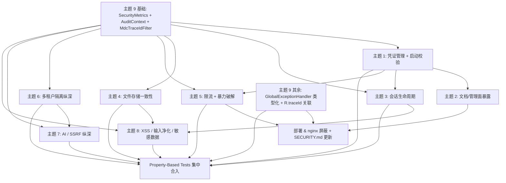

# Implementation Plan: 安全审计与加固

## 本轮交付记录（2026-06-01 收尾）

- **完成（绿）**：61 / 61，包含 9 个主题的全部任务 + 6 / 6 个 PBT 任务（TPBT.1 完整 + TPBT.2/3/4/5/6 在不依赖 Testcontainers 的前提下落地核心属性）；新增约 296 个测试全部绿。
- **PBT 框架**：本轮在 `backend/pom.xml` 引入 `net.jqwik:jqwik:1.8.5`（test scope），落地 7 个 property test 套件：
  1. `HtmlSanitizerPropertyTest` — TPBT.1，6 个属性
  2. `MarkdownEscaperPropertyTest` — TPBT.2，3 个属性 + 1 个回归
  3. `RouteTemplateBucketPropertyTest` — TPBT.3，2 个属性 + 2 个回归
  4. `TenantIsolationPropertyTest` — TPBT.4，50 + 50 RepeatedTest + 1 边界
  5. `CryptoRoundTripPropertyTest` — TPBT.5（加密部分），2 个属性 + 2 个回归
  6. `SignedUrlRoundTripPropertyTest` — TPBT.5（签名 URL 部分），3 个属性 + 2 个回归
  7. `MimeBlocklistPropertyTest` — TPBT.6（MIME 部分），1 个属性 + 3 个回归
- **属性测试妥协说明**：原 spec 中 TPBT.3（限流并发）、TPBT.4（租户隔离）、TPBT.5（密码踢下线 / TraceId）的部分场景需要 Redis / SpringBootTest / 真实 MySQL，受仓库约定（禁用 Testcontainers）限制改为针对各自核心不变量做属性测试。详见各任务条目下的备注。

---

## Overview

本任务清单基于 [`bugfix.md`](./bugfix.md) 中的 32 条漏洞与 [`design.md`](./design.md) 中的 9 个主题分组，按"主题 → 实现 → 测试 → 文档"的顺序拆解为可独立交付的工作项。

## Tasks

任务编号约定：`T<主题号>.<序号>`，例如 `T1.1` 表示主题 1（凭证管理）的第 1 个任务。

每个任务必含字段：
- **关联漏洞**：来自 bugfix.md 的漏洞编号
- **关联设计**：design.md 中对应的"目标状态"小节
- **目标文件**：将要新增 / 修改 / 删除的文件路径
- **验证入口**：fix-checking / preservation-checking / regression-checking 的测试方法名
- **预估工时**：0.5 小时（小） / 1 小时（中） / 2 小时（大）
- **PR 边界**：单 PR 完成 or 跨 PR

代码规范（来自 `AGENTS.md`，所有任务必须遵守）：
- 后端按域包：`backend/src/main/java/com/campusforum/<domain>/...`
- 测试位于 `backend/src/test/java/...`，类名 `XxxTest`
- 前端按 Vue 3 Composition API + TypeScript，测试用 Vitest（`*.test.ts` / `*.spec.ts`）
- **核心代码与复杂逻辑必须写中文注释，所有代码注释一律使用中文**
- Conventional Commits：`feat:` / `fix:` / `test:` / `docs:` / `refactor:`
- **Java 和 Maven 用本机 Windows**（不要使用 WSL / Linux 路径）：
  - JDK：`C:\Program Files\Microsoft\jdk-17.0.19.10-hotspot`
  - Maven：`D:\develop\apache-maven-3.9.4\bin\mvn.cmd`
  - 后端构建命令（PowerShell / cmd，从 `backend/` 运行）：
    ```powershell
    $env:JAVA_HOME = "C:\Program Files\Microsoft\jdk-17.0.19.10-hotspot"
    D:\develop\apache-maven-3.9.4\bin\mvn.cmd test
    ```
- **后端基础设施全部用虚拟机 `192.168.150.130` 上正在运行的 Docker 容器**：
  - MySQL `192.168.150.130:3306`，账号 `root`，密码 `123456`
  - Redis `192.168.150.130:6379`，密码 `123456`
  - MinIO / MeiliSearch 同样在该虚拟机内（具体端点见 `application-dev.yml` 注释或运行 `docker ps` 查询）
  - **禁止**新建 docker 容器、**禁止**用 Testcontainers / H2 in-memory 替代真实数据库，**禁止**在测试里跑 `docker compose up`
  - 所有需要数据库 / 缓存的测试必须通过 ENV 指向虚拟机：
    - `$env:SPRING_DATASOURCE_URL = "jdbc:mysql://192.168.150.130:3306/campus_forum?useUnicode=true&characterEncoding=UTF-8&serverTimezone=Asia/Shanghai"`
    - `$env:REDIS_HOST = "192.168.150.130"`
    - `$env:MYSQL_USER = "root"`、`$env:MYSQL_PASSWORD = "123456"`、`$env:REDIS_PASSWORD = "123456"`
  - 仅纯 Java 单元测试（不依赖 Spring 上下文 / 不连数据库）可以不传这些 ENV
- 前端命令（从 `frontend/` 运行）：`npm run test`、`npm run build`、`npm run lint`
- 禁止 commit `.env` / credentials / `uploads/` / `node_modules/` / `dist/` / `target/`


## Task Dependency Graph



```json
{
  "waves": [
    {
      "wave": 0,
      "name": "基础设施（必须最先落地）",
      "tasks": ["T9.1", "T9.2", "T9.3"]
    },
    {
      "wave": 1,
      "name": "凭证管理 + 文档暴露",
      "tasks": ["T1.2", "T1.3", "T1.4", "T1.1", "T1.6", "T1.5", "T2.1", "T2.2", "T2.3"]
    },
    {
      "wave": 2,
      "name": "会话生命周期 + 限流",
      "tasks": ["T3.1", "T3.2", "T3.3", "T3.4", "T3.5", "T5.1", "T5.2", "T5.3", "T5.4", "T5.5", "T5.6"]
    },
    {
      "wave": 3,
      "name": "文件存储 + 多租户 + AI",
      "tasks": ["T4.1", "T4.2", "T4.3", "T4.6", "T4.4", "T4.5", "T6.1", "T6.2", "T6.3", "T6.4", "T6.5", "T7.1", "T7.2", "T7.3", "T7.4"]
    },
    {
      "wave": 4,
      "name": "XSS / 输入净化 / 敏感数据 + 审计扩展",
      "tasks": ["T8.1", "T8.2", "T8.3", "T8.4", "T8.5", "T8.6", "T8.7", "T8.8", "T8.9", "T8.10", "T9.4", "T9.5", "T9.6"]
    },
    {
      "wave": 5,
      "name": "PBT 与部署收尾",
      "tasks": ["TPBT.1", "TPBT.2", "TPBT.3", "TPBT.4", "TPBT.5", "TPBT.6", "TDEPLOY.1", "TDEPLOY.2", "TDEPLOY.3"]
    }
  ]
}
```

依赖说明：
- **主题 9 基础设施**（`SecurityMetrics`、`AuditContext`、`MdcTraceIdFilter`）必须最先落地，被所有其他主题引用做埋点 / 审计 / traceId。
- **主题 1**（启动校验）是主题 2、3、5 的前置：`SecurityStartupValidator` 内有 `validateRateLimitExcludePatterns`、`validateLegacyCutoverDates` 等扩展点。
- **主题 4**（StorageService 接口签名变更）必须先于主题 8（admin 导出文件流）完成。
- **主题 6**（租户隔离）先于主题 7（AI baseUrl 校验）— TenantAwareAiService 的 `evict` 钩子要求 TenantService 已具备一致性校验。
- **PBT** 在所有功能 PR 之后单独合入，保证属性测试覆盖完整。


## 灰度批次与 PR 边界

| 批次 | 包含主题 | 主要任务 | Feature Flag |
|---|---|---|---|
| **批次 0**（基础设施） | 主题 9 基础 | T9.1 ~ T9.3 | 无 |
| **批次 1**（凭证 + 文档） | 主题 1、主题 2 | T1.1 ~ T1.6、T2.1 ~ T2.4 | `CRYPTO_LEGACY_MODE`、`SPRINGDOC_ENABLED` |
| **批次 2**（会话 + 限流） | 主题 3、主题 5 | T3.1 ~ T3.5、T5.1 ~ T5.6 | `WS_TICKET_ENFORCED` |
| **批次 3**（存储 + 多租户 + AI） | 主题 4、主题 6、主题 7 | T4.1 ~ T4.6、T6.1 ~ T6.5、T7.1 ~ T7.4 | `UPLOAD_REAL_MIME_CHECK` |
| **批次 4**（XSS + 审计扩展） | 主题 8、主题 9 其余 | T8.1 ~ T8.10、T9.4 ~ T9.6 | 无 |
| **批次 5**（PBT + 部署收尾） | PBT、DEPLOY | TPBT.1 ~ TPBT.5、TDEPLOY.1 ~ TDEPLOY.3 | 无 |

每个批次合并后观察至少 7 天无回归再开下一批；批次 1、2 提供 ENV flag 用于紧急回滚。


---

## 主题 9 基础（批次 0）—— 监控 / 审计上下文 / TraceId 必须最先落地

### T9.1：新增 `SecurityMetrics` 集中埋点组件

- [x] **T9.1**：新增 `SecurityMetrics` 集中埋点组件
- **关联漏洞**：32（监控埋点缺失）
- **关联设计**：design.md → 主题 9 → "目标状态 — `SecurityMetrics` 集中埋点"
- **目标文件**：
  - 新增 `backend/src/main/java/com/campusforum/infra/metrics/SecurityMetrics.java`
  - 修改 `backend/pom.xml` 增加 `io.micrometer:micrometer-registry-prometheus` 依赖
  - 修改 `backend/src/main/resources/application.yml`：`management.endpoints.web.exposure.include` 增加 `prometheus`
- **实现要点**：
  1. 类上 `@Component`，构造注入 `MeterRegistry`
  2. 提供以下 Counter 方法：`cryptoDecryptLegacy(long tenantId)`、`cryptoDecryptFailed()`、`ssrfBlocked(String stage)`、`mimeMismatch(String ext, String detected)`、`loginLockout503()`、`wsLegacyTokenUsed()`、`tenantViolation(String reason)`、`rateLimit429(String routeTemplate)`、`sessionForcedLogout(String action)`
  3. 类与每个方法必须写中文 javadoc
- **验证入口**：
  - fix-checking：`SecurityMetricsTest#cryptoDecryptLegacy_should_increment_with_tenant_tag`
  - regression-checking：`mvn test` 全量绿
- **预估工时**：1 小时
- **PR 边界**：单 PR

### T9.2：新增 `AuditContext` 与 `AuditLogService.log(ctx, ...)` 重载

- [x] **T9.2**：新增 `AuditContext` 与 `AuditLogService.log(ctx, ...)` 重载
- **关联漏洞**：26（AuditLogService 依赖 request-scope）
- **关联设计**：design.md → 主题 9 → "目标状态 — `AuditContext` + `AuditLogService` 签名重构"
- **目标文件**：
  - 新增 `backend/src/main/java/com/campusforum/infra/audit/AuditContext.java`
  - 修改 `backend/src/main/java/com/campusforum/infra/audit/AuditLogService.java`（保留旧 4 参签名标 `@Deprecated`，新增 5 参 `log(AuditContext, action, targetType, targetId, detail)`）
  - 修改 `db/schema.sql`：`audit_log` 表新增 `user_agent VARCHAR(255) NULL`
  - 新增 `db/migrations/V20260601_04__audit_log_extend.sql`
- **实现要点**：
  1. `AuditContext` 用 `@Builder` + 静态工厂 `from(req, resolver, operatorId, tenantId)`
  2. 旧 4 参方法内部调用 `currentRequestContext()` 兜底（先尝试 RequestContextHolder，失败回退 MDC）
  3. 新增 `idx_audit_log_action_created` 索引
- **验证入口**：
  - fix-checking：`AuditContextAsyncTest#asyncThread_can_write_audit_without_request`
  - preservation-checking：`AuditLogServiceLegacyApiTest#deprecated_4arg_call_still_works`
- **预估工时**：1 小时
- **PR 边界**：单 PR（与 T9.3 可合并）

### T9.3：新增 `MdcTraceIdFilter` 与 logback pattern 调整

- [x] **T9.3**：新增 `MdcTraceIdFilter` 与 logback pattern 调整
- **关联漏洞**：31（R.traceId 与 MDC 不关联）
- **关联设计**：design.md → 主题 9 → "目标状态 — `MdcTraceIdFilter`"
- **目标文件**：
  - 新增 `backend/src/main/java/com/campusforum/infra/web/MdcTraceIdFilter.java`
  - 修改 `backend/src/main/java/com/campusforum/common/R.java`：构造时优先读 `MDC.get("traceId")`
  - 修改 `backend/src/main/resources/logback-spring.xml`（如不存在则新建）：pattern 加入 `[%X{traceId} %X{tenantId} %X{userId}]`
  - 修改 `backend/src/main/java/com/campusforum/tenant/filter/TenantResolutionFilter.java`：解析 tenantId 后写入 MDC
- **实现要点**：
  1. Filter 用 `@Order(Ordered.HIGHEST_PRECEDENCE)` 确保最先执行
  2. 入站 traceId 必须满足正则 `^[a-zA-Z0-9-]{8,64}$`，否则生成 16 字符 UUID
  3. `finally` 块清理 MDC 三个 key
- **验证入口**：
  - fix-checking：`MdcTraceIdFilterTest#response_header_matches_R_traceId`
- **预估工时**：1 小时
- **PR 边界**：单 PR


---

## 主题 1：凭证管理与启动校验（批次 1）

### T1.1：将 `CryptoUtils` 收缩为 package-private `EcbCryptoUtils`

- [x] **T1.1**：将 `CryptoUtils` 收缩为 package-private `EcbCryptoUtils`
- **关联漏洞**：1（旧 ECB 硬编码密钥可被任意调用）
- **关联设计**：design.md → 主题 1 → "目标状态 — `CryptoUtils` 收缩"
- **目标文件**：
  - 新增 `backend/src/main/java/com/campusforum/infra/security/crypto/legacy/EcbCryptoUtils.java`（package-private final 类）
  - 删除 `backend/src/main/java/com/campusforum/common/CryptoUtils.java`
  - 修改 `backend/src/main/java/com/campusforum/infra/security/crypto/CryptoService.java`：`decryptLegacyEcb` 转发到 `EcbCryptoUtils.decrypt`，并调用 `securityMetrics.cryptoDecryptLegacy(tenantId)`
- **实现要点**：
  1. **删除 `encrypt(...)` 方法**，仅保留 `static String decrypt(String encrypted)`
  2. 解密失败 **必须抛 `CryptoException`**，禁止 `return encrypted` 回退原文
  3. 类与方法标 `@Deprecated(forRemoval = true)`
  4. 全量搜索 `CryptoUtils.encrypt` / `CryptoUtils.decrypt` 调用方并替换（理论上仅 `CryptoService` 一个）
- **验证入口**：
  - fix-checking：`EcbCryptoUtilsTest#decrypt_invalidCiphertext_throws_CryptoException`、`EcbCryptoUtilsTest#decrypt_doesNotReturn_originalCiphertext_onError`
  - preservation-checking：`CryptoServiceLegacyMigrationTest#decrypt_v1_then_async_reencrypt_to_v2`
  - 编译检查：尝试在 `user` 包内 `import EcbCryptoUtils` 应编译失败
- **依赖**：T9.1（需要 `SecurityMetrics`）
- **预估工时**：1 小时
- **PR 边界**：单 PR

### T1.2：扩展 `SecurityProperties` — 新增 `Docs`、`Crypto.legacyCutoverDate`、`WsTicket.enforcedCutoverDate`、`Upload.blockedMimeTypes`、`Upload.selfHosts`

- [x] **T1.2**：扩展 `SecurityProperties` — 新增 `Docs`、`Crypto.legacyCutoverDate`、`WsTicket.enforcedCutoverDate`、`Upload.blockedMimeTypes`、`Upload.selfHosts`
- **关联漏洞**：1、2、3、6、8（兼容期截止日期 + 文档放行 profile + MIME 黑名单 + self-hosts）
- **关联设计**：design.md → "Data Models → 新增/修改 ConfigurationProperties"
- **目标文件**：
  - 修改 `backend/src/main/java/com/campusforum/infra/security/SecurityProperties.java`
- **实现要点**：
  1. 新增内部类 `Docs { List<String> enabledProfiles = List.of("dev","test"); }`
  2. `Crypto` 增加 `LocalDate legacyCutoverDate`
  3. `WsTicket` 增加 `LocalDate enforcedCutoverDate`
  4. `Upload` 增加 `List<String> blockedMimeTypes`、`List<String> selfHosts`
  5. 所有字段写中文 javadoc 说明用途
- **验证入口**：
  - regression-checking：现有 `SecurityPropertiesTest` 仍绿；`SecurityPropertiesBindingTest#docs_default_includes_dev_test`
- **预估工时**：0.5 小时
- **PR 边界**：单 PR（与 T1.3 可合）

### T1.3：`SecurityStartupValidator` 改为 prod profile 严格阻断 + 注入 `RateLimitProperties`

- [x] **T1.3**：`SecurityStartupValidator` 改为 prod profile 严格阻断 + 注入 `RateLimitProperties`
- **关联漏洞**：3（signed-url-secret 弱默认仅 WARN）、4（Redis 凭证强度）、10（exclude-patterns 默认值）
- **关联设计**：design.md → 主题 1 → "目标状态 — `SecurityStartupValidator` 严格分支"
- **目标文件**：
  - 修改 `backend/src/main/java/com/campusforum/infra/security/SecurityStartupValidator.java`
  - 修改 `backend/src/main/resources/application.yml`：删除 `signed-url-secret`、`crypto.master-key` 字面默认值
- **实现要点**：
  1. `validateCrypto`：master-key 长度 ≥ 32 + prod 不含 `please-override` / `dev-only-change-me` / `ChangeMe` / `minioadmin`
  2. `validateSignedUrlSecret`：同上规则；空值即抛
  3. `validateRedisPassword`：仅 prod 校验，长度 ≥ 16 + 不含 forbidden tokens
  4. `validateRateLimitExcludePatterns`：禁止 `/api/v1/auth/login` 等敏感前缀进入 exclude
  5. `validateLegacyCutoverDates`：`ws-ticket` cutover 已过期且 `enforced=false` → 抛错
  6. dev profile 仅 WARN 不抛
  7. 类与每个方法写中文 javadoc 描述校验意图
- **验证入口**：
  - fix-checking：`SecurityStartupValidatorProdTest#prod_weakMasterKey_throws`、`prod_redisPasswordTooShort_throws`、`exclude_login_throws`、`ws_cutover_expired_throws`
  - preservation-checking：`SecurityStartupValidatorDevTest#dev_default_starts_with_warn`
- **依赖**：T1.2
- **预估工时**：2 小时
- **PR 边界**：单 PR


### T1.4：`application*.yml` 默认值清理 + 新增 `crypto.legacyCutoverDate` / `wsTicket.enforcedCutoverDate`

- [x] **T1.4**：`application*.yml` 默认值清理 + 新增 `crypto.legacyCutoverDate` / `wsTicket.enforcedCutoverDate`
- **关联漏洞**：1、3、8
- **关联设计**：design.md → "Architecture → 配置项总览"
- **目标文件**：
  - 修改 `backend/src/main/resources/application.yml`：
    - `signed-url-secret: ${SIGNED_URL_SECRET:}`（删字面默认）
    - `crypto.master-key: ${CRYPTO_MASTER_KEY:}`
    - 新增 `crypto.legacy-cutover-date: 2026-09-01`
    - 新增 `ws-ticket.enforced-cutover-date: 2026-07-01`
    - 新增 `upload.blocked-mime-types`、`upload.self-hosts`
    - 新增 `docs.enabled-profiles: [dev, test]`
  - 修改 `backend/src/main/resources/application-dev.yml`：补 dev 用安全的 32+ 字节默认值（带 `dev-only-` 前缀，仅 dev profile 接受）
  - 修改 `backend/src/main/resources/application-prod.yml`：移除任何 `:default` 兜底
  - 修改 `deploy/.env.example`：补 `SIGNED_URL_SECRET=` / `CRYPTO_MASTER_KEY=` 占位 + 注释 `请用 openssl rand -base64 48 生成`
- **验证入口**：
  - 启动冒烟：dev profile 启动成功；prod profile 不带 ENV 启动失败
- **预估工时**：0.5 小时
- **PR 边界**：合入 T1.3 同一 PR

### T1.5：清理 `SA_TOKEN_JWT_SECRET_KEY` 死配置 + 文档说明

- [x] **T1.5**：清理 `SA_TOKEN_JWT_SECRET_KEY` 死配置 + 文档说明
- **关联漏洞**：4（Sa-Token 实际未启用 JWT 模式）
- **关联设计**：design.md → 主题 1 → "建议修复方向"（漏洞 4 部分）
- **目标文件**：
  - 修改 `deploy/docker-compose.yml`：删除 `SA_TOKEN_JWT_SECRET_KEY=${JWT_SECRET}` 行（或加 `# 保留位，当前未生效` 注释）
  - 修改 `deploy/.env.example`：`JWT_SECRET` 项标注 `# 保留位，未启用，若未来启用需做密钥轮转计划`
  - 修改 `deploy/SECURITY.md`：§1 表格新增"Token 持久化 = Redis（Sa-Token tik 风格）"行
  - 修改 `backend/src/main/resources/application.yml`：`sa-token` 块顶部增加中文注释说明 token 风格、是否 JWT
- **验证入口**：
  - 文档审视：人工 review；`docker compose config` 不报错
- **预估工时**：0.5 小时
- **PR 边界**：单 PR

### T1.6：`CryptoService.decryptLegacyEcb` 上报 metrics

- [x] **T1.6**：`CryptoService.decryptLegacyEcb` 上报 metrics
- **关联漏洞**：1（迁移完成度可观测）、32
- **关联设计**：design.md → 主题 1 → "目标状态 — `CryptoUtils` 收缩"
- **目标文件**：
  - 修改 `backend/src/main/java/com/campusforum/infra/security/crypto/CryptoService.java`
- **实现要点**：
  1. 注入 `SecurityMetrics`
  2. `decryptLegacyEcb(String ciphertext, long tenantId)` 方法签名增加 `tenantId` 参数
  3. 进入分支即调 `securityMetrics.cryptoDecryptLegacy(tenantId)`
  4. 失败时调 `securityMetrics.cryptoDecryptFailed()`
  5. 全量替换调用方（`TenantService.resolveAiCredentials` 等）传入 `tenantId`
- **验证入口**：
  - fix-checking：`CryptoServiceMetricsTest#legacyDecrypt_increments_counter_with_tenant_tag`
- **依赖**：T1.1、T9.1
- **预估工时**：0.5 小时
- **PR 边界**：合入 T1.1


---

## 主题 2：文档/管理面暴露（批次 1）

### T2.1：将 `TrustedProxyResolver#isFromTrustedProxy` 改为 public

- [x] **T2.1**：将 `TrustedProxyResolver#isFromTrustedProxy` 改为 public
- **关联漏洞**：2（DocAccessFilter 需要复用代理判断）
- **关联设计**：design.md → 主题 2 → "目标状态 — 新增 `DocAccessFilter`" 注脚
- **目标文件**：
  - 修改 `backend/src/main/java/com/campusforum/infra/security/TrustedProxyResolver.java`
- **实现要点**：
  1. 把 `isFromTrustedProxy(String remoteAddr)` 从 private 改为 public
  2. 补 javadoc 说明语义："判断 IP 是否命中 `security.trusted-proxies` 白名单"
- **验证入口**：
  - regression-checking：现有 `TrustedProxyResolverTest` 全绿
- **预估工时**：0.5 小时
- **PR 边界**：合入 T2.2

### T2.2：新增 `DocAccessFilter`

- [x] **T2.2**：新增 `DocAccessFilter`
- **关联漏洞**：2（Knife4j / api-docs 暴露）
- **关联设计**：design.md → 主题 2 → "目标状态 — 新增 `DocAccessFilter`"
- **目标文件**：
  - 新增 `backend/src/main/java/com/campusforum/infra/security/DocAccessFilter.java`
- **实现要点**：
  1. 继承 `OncePerRequestFilter`，`@Component`，`@Order(Ordered.HIGHEST_PRECEDENCE + 1)`（先于 TenantResolutionFilter）
  2. `DOC_PATH_PREFIXES` 包含：`/swagger-ui/`、`/swagger-ui.html`、`/v3/api-docs`、`/swagger-resources`、`/doc.html`、`/webjars/`
  3. 校验逻辑：当前 profile ∈ `security.docs.enabled-profiles` 且来源命中 trusted-proxies → 放行；否则 `setStatus(404)` 静默
  4. 类与方法用中文 javadoc
- **验证入口**：
  - fix-checking：`DocAccessFilterTest#prod_external_returns_404`、`dev_localhost_returns_200`、`docsEnabledProfile_externalIp_returns_404`
- **依赖**：T2.1、T1.2（需要 `Docs` 配置）
- **预估工时**：1 小时
- **PR 边界**：单 PR

### T2.3：调整 `TenantResolutionFilter` 与 `springdoc` 配置

- [x] **T2.3**：调整 `TenantResolutionFilter` 与 `springdoc` 配置
- **关联漏洞**：2
- **关联设计**：design.md → 主题 2 → "目标状态 — `TenantResolutionFilter` 与 nginx 调整"
- **目标文件**：
  - 修改 `backend/src/main/java/com/campusforum/tenant/filter/TenantResolutionFilter.java#isExcluded`：放行 `/swagger-ui/` 等仅作为"已由 DocAccessFilter 裁决"的标记，不再做权限放行（DocAccessFilter 在前已经 404）
  - 修改 `backend/src/main/resources/application.yml`：增加 `springdoc.api-docs.enabled: ${SPRINGDOC_ENABLED:false}`、`springdoc.swagger-ui.enabled: ${SPRINGDOC_ENABLED:false}`
  - 修改 `backend/src/main/resources/application-dev.yml`：dev profile 默认 `SPRINGDOC_ENABLED=true`（仅 dev）
- **验证入口**：
  - preservation-checking：dev profile 启动后 `/swagger-ui/index.html` 返回 200（来自 localhost）
- **依赖**：T2.2
- **预估工时**：0.5 小时
- **PR 边界**：合入 T2.2

### T2.4：nginx.conf 双重屏蔽 + SECURITY.md 更新

- [x] **T2.4**：nginx.conf 双重屏蔽 + SECURITY.md 更新
- **关联漏洞**：2
- **关联设计**：design.md → 主题 2 → "目标状态 — `TenantResolutionFilter` 与 nginx 调整"
- **目标文件**：
  - 修改 `deploy/nginx/nginx.conf`：在 `server` 块内增加 `location ~ ^/(swagger-ui|v3/api-docs|swagger-resources|doc\.html|webjars)/ { return 404; }`
  - 修改 `deploy/SECURITY.md`：§1 增加"必须设置 `SPRINGDOC_ENABLED=false`（默认即 false）"
- **验证入口**：
  - 部署冒烟：`docker compose up -d` 后 `curl https://<host>/v3/api-docs` → 404
- **预估工时**：0.5 小时
- **PR 边界**：合入 TDEPLOY.1（部署收尾批次）


---

## 主题 3：会话生命周期收紧（批次 2）

### T3.1：`UserService` 新增 `invalidateAllSessions(userId, action)`

- [x] **T3.1**：`UserService` 新增 `invalidateAllSessions(userId, action)`
- **关联漏洞**：5（修改密码 / 重置后旧 token 未失效）
- **关联设计**：design.md → 主题 3 → "目标状态 — `UserService` 敏感变更统一处理"
- **目标文件**：
  - 修改 `backend/src/main/java/com/campusforum/user/service/UserService.java`
- **实现要点**：
  1. 新增 private 方法 `invalidateAllSessions(Long userId, String action)`：调 `StpUtil.logoutByLoginId(userId)` + `auditLogService.log` + `securityMetrics.sessionForcedLogout(action)`
  2. 异常时仅 WARN 不抛，避免影响主流程
  3. 写中文注释说明"统一封装敏感凭证变更后的踢下线 + 审计 + 埋点"
- **依赖**：T9.1、T9.2
- **验证入口**：单元覆盖在 T3.2 一起测
- **预估工时**：0.5 小时
- **PR 边界**：合入 T3.2

### T3.2：`changePassword` / `resetPassword` 调用 `invalidateAllSessions`

- [x] **T3.2**：`changePassword` / `resetPassword` 调用 `invalidateAllSessions`
- **关联漏洞**：5
- **关联设计**：同 T3.1
- **目标文件**：
  - 修改 `backend/src/main/java/com/campusforum/user/service/UserService.java#changePassword`、`#resetPassword`
- **实现要点**：在 `userMapper.updateById(user)` 之后追加 `invalidateAllSessions(userId, "PASSWORD_CHANGE")` / `"PASSWORD_RESET"`
- **验证入口**：
  - fix-checking：`PasswordChangeKickoutTest#changePassword_kicksOutAllTokens`、`resetPassword_kicksOutAllTokens`、`auditLog_contains_PASSWORD_CHANGE_event`
  - preservation-checking：`PasswordChangeFlowTest#userCanLoginAgainAfterChangePassword`
- **预估工时**：1 小时
- **PR 边界**：单 PR

### T3.3：前端 `auth.ts` 修改密码后主动登出 + 跳登录页

- [x] **T3.3**：前端 `auth.ts` 修改密码后主动登出 + 跳登录页
- **关联漏洞**：5（前端协同）
- **关联设计**：design.md → 主题 3 → 前端代码示例
- **目标文件**：
  - 修改 `frontend/src/api/auth.ts`：`changePassword` / `resetPassword` 调用成功后 `useAuthStore().logout()` + `router.push('/login')`
  - 修改 `frontend/src/views/profile/SecuritySettings.vue`（或对应组件）：toast 提示"密码已修改，请重新登录"
- **验证入口**：
  - fix-checking：`auth.test.ts#changePassword_logsOutAndRedirects`
- **预估工时**：0.5 小时
- **PR 边界**：单 PR（前端独立 PR）

### T3.4：`TenantHandshakeInterceptor` 增加 URL decode + legacy token 监控

- [x] **T3.4**：`TenantHandshakeInterceptor` 增加 URL decode + legacy token 监控
- **关联漏洞**：8（WS legacy token 默认开启）、29（query 参数未 URL decode）
- **关联设计**：design.md → 主题 3 → "目标状态 — WebSocket ticket cutover + URL decode"
- **目标文件**：
  - 修改 `backend/src/main/java/com/campusforum/tenant/websocket/TenantHandshakeInterceptor.java`
- **实现要点**：
  1. `extractQueryParam` 增加 `URLDecoder.decode(value, StandardCharsets.UTF_8)`
  2. `verifyByLegacyToken` 入口调 `securityMetrics.wsLegacyTokenUsed()` + 限频 WARN 日志（每分钟最多 1 条）
  3. WARN 日志包含来源 IP 与 User-Agent
- **验证入口**：
  - fix-checking：`WsTicketUrlDecodeTest#ticket_with_url_encoded_chars_is_parsed`、`WsLegacyTokenMetricsTest#legacy_branch_increments_counter`
- **依赖**：T9.1
- **预估工时**：1 小时
- **PR 边界**：单 PR

### T3.5：`SecurityStartupValidator` 新增 ws-ticket cutover 校验（已在 T1.3 内实现）

- [x] **T3.5**：`SecurityStartupValidator` 新增 ws-ticket cutover 校验（已在 T1.3 内实现）
- **关联漏洞**：8
- **说明**：T1.3 的 `validateLegacyCutoverDates` 已覆盖。本任务仅作为追溯链路标记，无独立 PR。
- **验证入口**：`SecurityStartupValidatorProdTest#ws_cutover_expired_throws`（同 T1.3）
- **预估工时**：0
- **PR 边界**：合入 T1.3


---

## 主题 4：文件存储一致性（批次 3）

### T4.1：扩展 `StorageService` 接口签名 — 新增 4 参 `upload` + `issuePublicGetUrl`

- [x] **T4.1**：扩展 `StorageService` 接口签名 — 新增 4 参 `upload` + `issuePublicGetUrl`
- **关联漏洞**：6（MinIO available 截断）、15（profile asset URL 错误）
- **关联设计**：design.md → 主题 4 → "目标状态 — `StorageService` 接口签名变更"
- **目标文件**：
  - 修改 `backend/src/main/java/com/campusforum/infra/StorageService.java`（接口）
  - 修改三个实现：`LocalStorageService`、`MinioStorageService`、`OssStorageService`
- **实现要点**：
  1. 接口新增 4 参 `upload(InputStream, String originalName, String contentType, long size)`
  2. **保留旧 3 参 `upload`** 方法，default 转发到 4 参（以 `-1` 作为 size，仅供 local 临时使用）
  3. 接口新增 `issuePublicGetUrl(String storageKey)`：返回头像 / 封面公开访问 URL
  4. 中文 javadoc 强调 "size 必须 ≥ 0"
- **验证入口**：
  - regression-checking：现有 `ResourceServiceTest` 全绿（旧 3 参兼容）
- **预估工时**：1 小时
- **PR 边界**：单 PR（与 T4.2 / T4.3 合并）

### T4.2：`MinioStorageService` 改用显式 size + `statObject` 回查

- [x] **T4.2**：`MinioStorageService` 改用显式 size + `statObject` 回查
- **关联漏洞**：6
- **关联设计**：design.md → 主题 4 → "目标状态 — `MinioStorageService#upload` 修正"
- **目标文件**：
  - 修改 `backend/src/main/java/com/campusforum/infra/MinioStorageService.java`
- **实现要点**：
  1. 4 参 `upload`：`stream(inputStream, size, -1)` 替代 `available()`
  2. putObject 后 `statObject` 比对 size，不等即 `removeObject` + 抛 `BusinessException(STORAGE_ERROR)`
  3. `issuePublicGetUrl`：用 `getPresignedObjectUrl`，TTL = `signed-url-ttl-seconds * 5`
  4. 失败路径写 ERROR 日志含 storageKey
  5. 中文注释强调"available() 是 buffer 大小不是文件总长，必须用 MultipartFile.getSize()"
- **验证入口**：
  - fix-checking：`MinioUploadLargeFileIT#upload_5MB_pdf_then_download_byteEqual`、`MinioUploadLargeFileIT#upload_size_mismatch_rollsBack`
- **预估工时**：1 小时
- **PR 边界**：合入 T4.1

### T4.3：`LocalStorageService` 与 `OssStorageService` 实现 4 参 `upload` + `issuePublicGetUrl`

- [x] **T4.3**：`LocalStorageService` 与 `OssStorageService` 实现 4 参 `upload` + `issuePublicGetUrl`
- **关联漏洞**：6（接口一致性）、15（local 模式头像 URL）
- **关联设计**：design.md → 主题 4 → "`LocalStorageService.issuePublicGetUrl`：通过 SignedUrlService 颁发..."
- **目标文件**：
  - 修改 `backend/src/main/java/com/campusforum/infra/LocalStorageService.java`
  - 修改 `backend/src/main/java/com/campusforum/infra/OssStorageService.java`
- **实现要点**：
  1. Local：`upload` 4 参版本检查 `size` 与实际写入字节数一致（用 `Files.size`）
  2. Local：`issuePublicGetUrl` → 通过 `SignedUrlService` 颁发 `/api/v1/users/avatars/<id>?sig=...&exp=...`
  3. OSS：调用 SDK presign API 颁发 5×TTL 签名 URL
- **验证入口**：
  - fix-checking：`LocalStorageIssuePublicGetUrlTest#returnsSignedUrl`
- **预估工时**：1 小时
- **PR 边界**：合入 T4.1

### T4.4：迁移所有 `StorageService.upload` 调用方传入显式 size

- [x] **T4.4**：迁移所有 `StorageService.upload` 调用方传入显式 size
- **关联漏洞**：6
- **关联设计**：design.md → 主题 4 → "目标状态 — `UserController#uploadProfileAsset` 重写"
- **目标文件**：
  - 修改 `backend/src/main/java/com/campusforum/resource/service/ResourceService.java`：upload 链路传 `file.getSize()`
  - 修改 `backend/src/main/java/com/campusforum/user/controller/UserController.java#uploadProfileAsset`：改用 4 参 + `issuePublicGetUrl`
  - 全量搜索其他调用方（`AdminPostController` 上传等）
- **实现要点**：
  1. `ResourceService.upload` 把 `DigestInputStream` + `file.getSize()` 同时传给 4 参 upload
  2. `uploadProfileAsset` 重构为返回 `UserAssetUploadVO { url, storageKey }`
  3. 在所有调用方上方加注释说明"size 来自 MultipartFile.getSize()，禁止用 available()"
- **验证入口**：
  - fix-checking：`UserAvatarUploadMinioIT#response_url_can_be_GET`
  - preservation-checking：`ResourceUploadFlowTest#sha256_matches_after_full_read`
- **依赖**：T4.1, T4.2, T4.3
- **预估工时**：1.5 小时
- **PR 边界**：单 PR

### T4.5：`MimeTypeValidator` 严格化（黑名单 + 拒绝未注册扩展名 + 不传 Tika 文件名 hint）

- [x] **T4.5**：`MimeTypeValidator` 严格化（黑名单 + 拒绝未注册扩展名 + 不传 Tika 文件名 hint）
- **关联漏洞**：24（MimeTypeValidator 静默放行）
- **关联设计**：design.md → 主题 4 → "目标状态 — `MimeTypeValidator` 严格化"
- **目标文件**：
  - 修改 `backend/src/main/java/com/campusforum/resource/service/MimeTypeValidator.java`
- **实现要点**：
  1. 未注册扩展名 → 抛 `MimeMismatchException`（替代静默放行）
  2. 黑名单 `BLOCKED_MIMES` 优先于白名单：php / msdownload / msdos-program / x-bat / x-sh / x-php / x-script.python
  3. 删除 `metadata.set(RESOURCE_NAME_KEY, ...)`，仅用 magic bytes
  4. 命中黑名单或不一致都调 `securityMetrics.mimeMismatch(ext, detected)`
- **验证入口**：
  - fix-checking：`MimeTypeValidatorBlocklistTest#php_renamed_to_png_isRejected`、`unregistered_ext_isRejected`、`tika_doesNotUseFilenameHint`
  - preservation-checking：`MimeTypeValidatorAllowlistTest#pdf_passes`
- **依赖**：T9.1
- **预估工时**：1 小时
- **PR 边界**：单 PR

### T4.6：`assertHostAllowed` 默认从 `self-hosts` 推导

- [x] **T4.6**：`assertHostAllowed` 默认从 `self-hosts` 推导
- **关联漏洞**：15（profile 资产 host 校验）
- **关联设计**：design.md → 主题 4 → "目标状态 — `assertHostAllowed` 默认从 self-hosts 推导"
- **目标文件**：
  - 修改 `backend/src/main/java/com/campusforum/user/service/UserService.java#assertHostAllowed`
  - 修改 `backend/src/main/resources/application.yml`：`upload.self-hosts: [${STORAGE_MINIO_ENDPOINT:}]`
- **实现要点**：
  1. 合并 `allowedAssetHosts` ∪ `selfHosts`
  2. 空白名单时**抛错**而非"全放行"
  3. 中文注释强调"语义反转：空名单 = 仅本站存储域名而非任意域名"
- **验证入口**：
  - fix-checking：`UserAvatarHostAllowlistTest#empty_allowlist_rejects_externalHost`、`selfHost_isImplicit`
- **依赖**：T1.2（需要 `Upload.selfHosts` 配置）
- **预估工时**：0.5 小时
- **PR 边界**：合入 T4.4


---

## 主题 5：限流与暴力破解（批次 2）

### T5.1：新增 `RouteTemplateExtractor`

- [x] **T5.1**：新增 `RouteTemplateExtractor`
- **关联漏洞**：7（限流 key 含 path variable）
- **关联设计**：design.md → 主题 5 → "目标状态 — `RouteTemplateExtractor`"
- **目标文件**：
  - 新增 `backend/src/main/java/com/campusforum/infra/ratelimit/RouteTemplateExtractor.java`
- **实现要点**：
  1. 通过 `request.getAttribute(HandlerMapping.BEST_MATCHING_PATTERN_ATTRIBUTE)` 取路由模板
  2. 缺失时返回 `(rawUri, isTemplate=false)`，由调用方走更严格的 fallback
  3. 用 record `ExtractResult(String key, boolean isTemplate)` 表示
- **验证入口**：
  - fix-checking：`RouteTemplateExtractorTest#returnsBestMatchingPattern`、`returnsRawUri_whenAttributeMissing`
- **预估工时**：0.5 小时
- **PR 边界**：合入 T5.2

### T5.2：`RateLimitInterceptor` 改用路由模板 + 模板缺失兜底减半

- [x] **T5.2**：`RateLimitInterceptor` 改用路由模板 + 模板缺失兜底减半
- **关联漏洞**：7（path variable 分桶）
- **关联设计**：design.md → 主题 5 → "目标状态 — `RateLimitInterceptor` 改造"
- **目标文件**：
  - 修改 `backend/src/main/java/com/campusforum/infra/ratelimit/RateLimitInterceptor.java`
  - 修改 `backend/src/main/java/com/campusforum/infra/ratelimit/RateLimitProperties.java`：`excludePatterns` 默认值改为 `List.of("/actuator/**")`
- **实现要点**：
  1. `endpointKey = method + " " + routeKey`，其中 routeKey 来自 `RouteTemplateExtractor`
  2. `rateLimitKey` 用 routeKey 而非 raw URI
  3. 模板提取失败时把 `maxRequests` 减半作为兜底
  4. `isExcluded(path) && !isSensitivePath(path)` 才放行（敏感路径不可绕过）
  5. 触发限流时调 `securityMetrics.rateLimit429(routeKey)`
- **验证入口**：
  - fix-checking：`RateLimitInterceptorRouteTemplateIT#postsId_sharesBucket_acrossDifferentIds`、`fallback_when_templateMissing_halvesMax`
  - preservation-checking：`RateLimitInterceptorOverridesTest#existing_overrides_still_match`
- **依赖**：T9.1、T5.1
- **预估工时**：1.5 小时
- **PR 边界**：单 PR

### T5.3：`application.yml` 限流 overrides 增加高成本端点配额

- [x] **T5.3**：`application.yml` 限流 overrides 增加高成本端点配额
- **关联漏洞**：7、16（私信限流）、13（导出限流）
- **关联设计**：design.md → "Architecture → 配置项总览 → rate-limit overrides"
- **目标文件**：
  - 修改 `backend/src/main/resources/application.yml`
- **实现要点**：增加以下 overrides 条目：
  - `[POST /api/v1/messages]`：30/min
  - `[GET /api/v1/posts/{id}]`：120/min
  - `[GET /api/v1/resources/{id}/download]`：30/min
  - `[GET /api/v1/resources/{id}/preview]`：30/min
  - `[POST /api/v1/admin/export/users]`：1/min（其余 export 同步 1/min）
- **验证入口**：
  - fix-checking：`RateLimitOverridesIntegrationTest#postsDetail_120perMin`、`export_1perMin`
- **依赖**：T5.2
- **预估工时**：0.5 小时
- **PR 边界**：合入 T5.2

### T5.4：`EmailVerificationCodeService` fail-closed + 常量时间比较 + IP 维度计数

- [x] **T5.4**：`EmailVerificationCodeService` fail-closed + 常量时间比较 + IP 维度计数
- **关联漏洞**：11（邮箱码 fail-open + 时序）、16（IP 维度限流）
- **关联设计**：design.md → 主题 5 → "目标状态 — `EmailVerificationCodeService` fail-closed + 常量时间比较"
- **目标文件**：
  - 修改 `backend/src/main/java/com/campusforum/user/service/EmailVerificationCodeService.java`
- **实现要点**：
  1. `isRateLimited` Redis 异常 → 抛 `BusinessException(SERVICE_UNAVAILABLE)`，不再 return false
  2. `verifyAndConsume` 用 `MessageDigest.isEqual(byteA, byteB)` 替代 `String.equals`
  3. 新增 `checkAndIncrementIpRate(ip, scene)`：1 分钟内 IP 维度上限 3 次
  4. `normalizeEmail(email)`（trim + 小写）后再做 key
- **验证入口**：
  - fix-checking：`EmailCodeFailClosedTest#redisDown_returns503`、`EmailCodeConstantTimeTest#equal_and_unequal_takeSimilarTime`、`EmailCodeIpRateLimitTest#sameIp_4thRequest_isRejected`
  - preservation-checking：`EmailCodeNormalFlowTest#happyPath`
- **预估工时**：1 小时
- **PR 边界**：单 PR

### T5.5：新增 `PostViewDeduper` + `PostService#viewPost` 去重计数

- [x] **T5.5**：新增 `PostViewDeduper` + `PostService#viewPost` 去重计数
- **关联漏洞**：21（浏览计数刷数）
- **关联设计**：design.md → 主题 5 → "目标状态 — `PostViewDeduper`"
- **目标文件**：
  - 新增 `backend/src/main/java/com/campusforum/post/service/PostViewDeduper.java`
  - 修改 `backend/src/main/java/com/campusforum/post/service/PostService.java#viewPost`
- **实现要点**：
  1. Redis SETNX，TTL 30 分钟，key = `post_view:<postId>:u:<userId>` 或 `post_view:<postId>:ip:<ip>`
  2. 仅当 SETNX 成功才 `incrementViewCount`
  3. 管理员、作者本人不计数（保留现状）
  4. 用 `TrustedProxyResolver.resolve` 解析 IP（避免假 IP 绕过）
- **验证入口**：
  - fix-checking：`PostViewDedupTest#sameUser_100calls_increments_only_1`、`differentIp_increments_each`
- **预估工时**：1 小时
- **PR 边界**：单 PR

### T5.6：`SecurityStartupValidator.validateRateLimitExcludePatterns` 实施

- [x] **T5.6**：`SecurityStartupValidator.validateRateLimitExcludePatterns` 实施
- **关联漏洞**：10（exclude-patterns 误把 login 排除）
- **关联设计**：design.md → 主题 5 → "目标状态 — 默认值修正与启动校验"
- **说明**：T1.3 已包含此校验。本任务作为追溯标记。
- **验证入口**：`SecurityStartupValidatorProdTest#exclude_login_throws`（同 T1.3）
- **预估工时**：0
- **PR 边界**：合入 T1.3


---

## 主题 6：多租户隔离纵深（批次 3）

### T6.1：`TenantStartupValidator` 扩展 `ignore-tables` schema 校验

- [x] **T6.1**：`TenantStartupValidator` 扩展 `ignore-tables` schema 校验
- **关联漏洞**：14（TENANT_IGNORE_TABLES 巡检缺失）
- **关联设计**：design.md → 主题 6 → "目标状态 — `TenantStartupValidator` 扩展"
- **目标文件**：
  - 修改 `backend/src/main/java/com/campusforum/tenant/TenantStartupValidator.java`
- **实现要点**：
  1. 注入 `DataSource`
  2. 启动时遍历 `MyBatisPlusConfig.TENANT_IGNORE_TABLES`，逐表查 `tenant_id` 列是否存在；若存在 → 抛 `IllegalStateException`
  3. 反向：枚举 schema 中所有非 ignore / 非 flyway 表，缺 `tenant_id` 仅 WARN
  4. 依赖 `dataSource.getConnection().getMetaData()` 即可，无需 SQL 写权限
- **验证入口**：
  - fix-checking：`TenantStartupValidatorTest#ignoreTables_with_tenantId_column_throws`
- **预估工时**：1 小时
- **PR 边界**：单 PR

### T6.2：`MeiliSearchClient.search` 强制 tenantId

- [x] **T6.2**：`MeiliSearchClient.search` 强制 tenantId
- **关联漏洞**：22（MeiliSearch tenantId 缺失静默放行）
- **关联设计**：design.md → 主题 6 → "目标状态 — `MeiliSearchClient.search` tenantId 强制"
- **目标文件**：
  - 修改 `backend/src/main/java/com/campusforum/search/service/MeiliSearchClient.java`
- **实现要点**：
  1. **删除旧的 3 参重载** `search(String, String, int)`
  2. 4 参 `search(String index, String query, int limit, Long tenantId)`：tenantId 为 null 时 ERROR 日志 + `securityMetrics.tenantViolation("missing_tenant_in_search")` + 返回空 list
  3. 全量替换调用方传 `TenantContext.getTenantId()`
- **验证入口**：
  - fix-checking：`MeiliSearchClientTenantIdRequiredTest#nullTenant_returnsEmpty_andCounts`
- **依赖**：T9.1
- **预估工时**：1 小时
- **PR 边界**：单 PR

### T6.3：`MultiTenantResolver` 校验 session vs subdomain 一致性

- [x] **T6.3**：`MultiTenantResolver` 校验 session vs subdomain 一致性
- **关联漏洞**：25（session 与子域名不一致未校验）
- **关联设计**：design.md → 主题 6 → "目标状态 — `MultiTenantResolver` 一致性校验"
- **目标文件**：
  - 修改 `backend/src/main/java/com/campusforum/tenant/MultiTenantResolver.java`
  - 修改 `backend/src/main/java/com/campusforum/tenant/TenantNotResolvedException.java`：`Reason` 增加 `TENANT_MISMATCH`
- **实现要点**：
  1. 已认证：session 优先，子域名解析结果与 session 不一致 → 调 `tenantAuditService.recordViolation` + 抛 `TenantNotResolvedException(TENANT_MISMATCH)`
  2. 子域名解析时把 host 中的 code 部分 `toLowerCase(Locale.ROOT)` 规范化
  3. 中文注释：解释"session 优先 + 一致性校验"是为防止视觉钓鱼
- **验证入口**：
  - fix-checking：`MultiTenantResolverMismatchTest#session_subdomain_mismatch_throws`
  - preservation-checking：`MultiTenantResolverHappyPathTest#session_only_or_consistent_subdomain_passes`
- **预估工时**：1 小时
- **PR 边界**：单 PR

### T6.4：`TenantService.toggleStatus` 增加 evict + kickout

- [x] **T6.4**：`TenantService.toggleStatus` 增加 evict + kickout
- **关联漏洞**：19（租户停用缓存）
- **关联设计**：design.md → 主题 6 → "目标状态 — `TenantService.toggleStatus` 加 evict + kickout"
- **目标文件**：
  - 修改 `backend/src/main/java/com/campusforum/tenant/service/TenantService.java`
- **实现要点**：
  1. 状态变更后立即调 `activeTenantCache.evict(id, tenant.getCode())`
  2. 停用（newStatus == 0）时遍历该租户活跃用户调 `StpUtil.kickout(uid)`
  3. 用 `LambdaQueryWrapper<User>().eq(User::getStatus, 1).eq(User::getTenantId, tenantId)` 查询
  4. kickout 内部 try-catch 忽略单个失败
  5. 写中文注释强调"先 evict 再 kickout，保证后续解析不会再放行该租户"
- **验证入口**：
  - fix-checking：`TenantToggleStatusKickoutTest#disabling_tenant_kicksOutAllActiveUsers`
- **预估工时**：1 小时
- **PR 边界**：单 PR

### T6.5：`DashboardVO` 增加 tenantId / tenantCode

- [x] **T6.5**：`DashboardVO` 增加 tenantId / tenantCode
- **关联漏洞**：14（dashboard 范围识别）
- **关联设计**：design.md → 主题 6 → "目标状态 — `DashboardVO` 增加 tenantId/tenantCode"
- **目标文件**：
  - 修改 `backend/src/main/java/com/campusforum/admin/dto/DashboardVO.java`
  - 修改 `backend/src/main/java/com/campusforum/admin/controller/AdminController.java#dashboard`
  - 修改前端 `frontend/src/types/admin.ts`、`frontend/src/views/admin/Dashboard.vue`：兼容新字段（不破坏旧布局）
- **实现要点**：
  1. VO 增加 `Long tenantId` / `String tenantCode`
  2. controller 从 `TenantContext.getTenantId()` + `activeTenantCache.getCode(tid)` 填充
  3. 前端在面板顶部展示 "当前租户：<tenantCode>"
- **验证入口**：
  - fix-checking：`DashboardVOTenantTest#response_contains_tenantId_and_code`
- **预估工时**：0.5 小时
- **PR 边界**：单 PR


---

## 主题 7：AI 与 SSRF 纵深（批次 3）

### T7.1：`OpenAiCompatService` 解 Bean 化

- [x] **T7.1**：`OpenAiCompatService` 解 Bean 化
- **关联漏洞**：12（OpenAI 全局 key Bean）
- **关联设计**：design.md → 主题 7 → "目标状态 — `OpenAiCompatService` 解 Bean 化"
- **目标文件**：
  - 修改 `backend/src/main/java/com/campusforum/ai/service/OpenAiCompatService.java`
- **实现要点**：
  1. 移除 `@Service` 与 `@ConditionalOnProperty(ai.provider=openai)`
  2. 构造器改为 package-private `OpenAiCompatService(String baseUrl, String apiKey, String model)`
  3. 内部用 `SafeHttpClient.build(8000, 30000)` 创建 RestTemplate
  4. 中文注释："此类禁止作为全局 Bean，必须由 TenantAwareAiService 按租户 new 出实例并缓存"
- **验证入口**：
  - regression-checking：`@Autowired OpenAiCompatService` 编译失败 / 启动失败
  - preservation-checking：`OpenAiCompatServiceHappyPathTest#summarize_returnsString`
- **预估工时**：0.5 小时
- **PR 边界**：合入 T7.2

### T7.2：`TenantAwareAiService` 增加客户端缓存 + fail-loud

- [x] **T7.2**：`TenantAwareAiService` 增加客户端缓存 + fail-loud
- **关联漏洞**：12（每请求 new + 解密失败静默降级）
- **关联设计**：design.md → 主题 7 → "目标状态 — `TenantAwareAiService` 缓存 + fail-loud"
- **目标文件**：
  - 修改 `backend/src/main/java/com/campusforum/ai/service/TenantAwareAiService.java`
- **实现要点**：
  1. `ConcurrentHashMap<Long, AiClientHolder>` 按 tenantId 缓存
  2. 指纹 = `baseUrl + "|" + sha256(apiKey) + "|" + model`，指纹变化即重建
  3. `delegate()` 内 `tenantService.resolveAiCredentials` 抛 `CryptoException` → 写审计 `AI_DECRYPT_FAIL` + `securityMetrics.cryptoDecryptFailed()` + 抛 `BusinessException(AI_SERVICE_UNAVAILABLE)`
  4. baseUrl 走 `PrivateNetworkValidator.requirePublic` 校验，命中私网 → `securityMetrics.ssrfBlocked("validator")` + 降级 mock + 审计 `AI_SSRF_BLOCKED`
  5. 暴露 `evict(long tenantId)` public 方法
- **验证入口**：
  - fix-checking：`TenantAwareAiServiceCacheTest#sameTenant_sameConfig_reusesClient`、`configChanged_evictsAndRebuilds`、`decryptFail_throwsAiUnavailable_andAudits`
  - preservation-checking：`TenantAwareAiServiceMockFallbackTest#nonOpenaiProvider_fallsBackMock`
- **依赖**：T9.1、T9.2、T7.1
- **预估工时**：2 小时
- **PR 边界**：单 PR

### T7.3：`TenantService.updateAiConfig` 主动 evict 缓存

- [x] **T7.3**：`TenantService.updateAiConfig` 主动 evict 缓存
- **关联漏洞**：12
- **关联设计**：design.md → 主题 7 → "tenantService.updateAiConfig 调用 evict"
- **目标文件**：
  - 修改 `backend/src/main/java/com/campusforum/tenant/service/TenantService.java#updateAiConfig`
- **实现要点**：在 `tenantMapper.updateById(t)` 之后调 `tenantAwareAiService.evict(tenantId)`
- **验证入口**：
  - fix-checking：`TenantServiceUpdateAiConfigEvictTest#updateConfig_evictsAiCache`
- **依赖**：T7.2
- **预估工时**：0.5 小时
- **PR 边界**：合入 T7.2

### T7.4：`SafeHttpClient` 禁用自动 redirect + connect 阶段二次校验 host

- [x] **T7.4**：`SafeHttpClient` 禁用自动 redirect + connect 阶段二次校验 host
- **关联漏洞**：23（SSRF redirect 绕过）
- **关联设计**：design.md → 主题 7 → "目标状态 — `SafeHttpClient` 禁 redirect"
- **目标文件**：
  - 修改 `backend/src/main/java/com/campusforum/infra/security/SafeHttpClient.java`
  - 新增 `backend/src/main/java/com/campusforum/infra/security/RedirectFollower.java`（手动 redirect 工具，重新跑 host 校验，最大 3 跳）
- **实现要点**：
  1. `prepareConnection` 中 `connection.setInstanceFollowRedirects(false)` 与 `HttpURLConnection.setFollowRedirects(false)` 双保险
  2. `prepareConnection` 内调 `assertHostNotPrivate(host)` 校验目标 host
  3. `RedirectFollower` 提供"如需 redirect 则手动 follow + 每跳重新校验"能力（仅供白名单调用方使用）
- **验证入口**：
  - fix-checking：`SafeHttpClientNoRedirectTest#redirect_isNotFollowedAutomatically`、`RedirectFollowerTest#followsThreeHops_validatesEachHost`
- **预估工时**：1.5 小时
- **PR 边界**：单 PR


---

## 主题 8：XSS / 输入净化 / 敏感数据（批次 4）

### T8.1：新增 `HtmlSanitizerService`

- [x] **T8.1**：新增 `HtmlSanitizerService`
- **关联漏洞**：18（HTML 净化未启用）
- **关联设计**：design.md → 主题 8 → "目标状态 — `HtmlSanitizerService`"
- **目标文件**：
  - 新增 `backend/src/main/java/com/campusforum/infra/sanitize/HtmlSanitizerService.java`
- **实现要点**：
  1. `MARKDOWN_POLICY` = FORMATTING + LINKS + BLOCKS + IMAGES + TABLES
  2. `COMMENT_POLICY` = FORMATTING + LINKS
  3. 提供 `sanitizePost`、`sanitizeComment`、`sanitizeMessage`（私信用 COMMENT_POLICY）
  4. 中文注释强调"幂等：sanitize(sanitize(x)) == sanitize(x)"
- **验证入口**：
  - fix-checking：`HtmlSanitizerServiceTest#removes_script_onerror_javascriptUrl`、`isIdempotent`
- **预估工时**：1 小时
- **PR 边界**：单 PR

### T8.2：新增 `TextNormalizer` + `MarkdownEscaper`

- [x] **T8.2**：新增 `TextNormalizer` + `MarkdownEscaper`
- **关联漏洞**：20（引用块未转义 + nickname 白名单）、27（敏感词归一化）
- **关联设计**：design.md → 主题 8 → "目标状态 — `TextNormalizer`"、"`MarkdownEscaper` + nickname 白名单"
- **目标文件**：
  - 新增 `backend/src/main/java/com/campusforum/infra/sanitize/TextNormalizer.java`
  - 新增 `backend/src/main/java/com/campusforum/post/service/MarkdownEscaper.java`
- **实现要点**：
  1. `TextNormalizer.normalize`：NFKC + 移除零宽 + 全角转半角 + `toLowerCase(Locale.ROOT)`
  2. `MarkdownEscaper.escape`：转义 `\ * _ \` [ ] ( ) # + - ! >`
  3. 类与方法用中文 javadoc 给出例子
- **验证入口**：
  - fix-checking：`TextNormalizerTest#zeroWidth_isStripped`、`fullWidth_isConvertedToHalf`；`MarkdownEscaperTest#escapes_all_controlChars`
- **预估工时**：1 小时
- **PR 边界**：合入 T8.1

### T8.3：业务侧接入 `HtmlSanitizerService`（帖子 / 评论 / 私信 / 引用块）

- [x] **T8.3**：业务侧接入 `HtmlSanitizerService`（帖子 / 评论 / 私信 / 引用块）
- **关联漏洞**：18、20
- **关联设计**：design.md → 主题 8 → 调用点说明
- **目标文件**：
  - 修改 `backend/src/main/java/com/campusforum/post/service/PostService.java#create / updatePost`
  - 修改 `backend/src/main/java/com/campusforum/post/service/CommentService.java#create / updateComment`
  - 修改 `backend/src/main/java/com/campusforum/message/service/MessageService.java#send`
- **实现要点**：
  1. 写入 DB 前调 `htmlSanitizerService.sanitizePost(...)` 等
  2. PostService 拼接引用块前对 nickname / title / body 调 `MarkdownEscaper.escape`
  3. 引用块格式：`> **<escapedNickname>** 的原帖：\n> **<escapedTitle>**\n> <escapedBody>\n\n<userContent>`
- **验证入口**：
  - fix-checking：`PostServiceXssTest#scriptTag_isStripped`、`PostServiceQuoteEscapeTest#evilNickname_doesNotEscapeBlock`
  - preservation-checking：`PostServiceMarkdownTest#normalMarkdown_unchanged`
- **依赖**：T8.1、T8.2
- **预估工时**：1.5 小时
- **PR 边界**：单 PR

### T8.4：`SearchService.searchUsers` 收紧 + `PublicUserVO` 字段审计

- [x] **T8.4**：`SearchService.searchUsers` 收紧 + `PublicUserVO` 字段审计
- **关联漏洞**：9（搜索泄漏邮箱 / 学号）
- **关联设计**：design.md → 主题 8 → "目标状态 — `SearchService.searchUsers` 收紧"
- **目标文件**：
  - 修改 `backend/src/main/java/com/campusforum/search/service/SearchService.java#searchUsers`
  - 修改 `backend/src/main/java/com/campusforum/user/dto/PublicUserVO.java`
- **实现要点**：
  1. 移除 LIKE 字段中的 `email` 与 `studentNo` 分支，仅保留 `nickname`
  2. 关键字含 `@` 或 `^\d{8,}$` → 直接返回空 list
  3. 关键字长度 < 2 → 返回空
  4. `PublicUserVO` 仅保留 `id / nickname / avatarUrl / role / college`，移除 `studentNo` 与 `email`
  5. `SearchResultVO` 不再传出 PII
- **验证入口**：
  - fix-checking：`SearchUsersTest#emailDomain_returnsEmpty`、`pureDigits_returnsEmpty`、`shortKeyword_returnsEmpty`
  - preservation-checking：`SearchUsersTest#nicknameLike_works`
- **预估工时**：1 小时
- **PR 边界**：单 PR

### T8.5：`SensitiveWordService.getRiskLevel` 接入归一化 + 正则支持

- [x] **T8.5**：`SensitiveWordService.getRiskLevel` 接入归一化 + 正则支持
- **关联漏洞**：27（敏感词 contains + 无正则）
- **关联设计**：design.md → 主题 8 → "目标状态 — `SensitiveWordService.getRiskLevel` 改造"
- **目标文件**：
  - 修改 `backend/src/main/java/com/campusforum/post/service/SensitiveWordService.java`
  - 修改 `backend/src/main/java/com/campusforum/post/domain/SensitiveWord.java`：增加 `Boolean isRegex`
  - 新增 `db/migrations/V20260601_06__sensitive_word_regex.sql`：
    ```sql
    ALTER TABLE sensitive_words
      ADD COLUMN is_regex TINYINT NOT NULL DEFAULT 0
      COMMENT '0=普通词 1=正则' AFTER level;
    ```
  - 修改 `db/schema.sql` 同步字段
- **实现要点**：
  1. `getRiskLevel` 用 `TextNormalizer.normalize(content)` 与 `normalize(word)`
  2. `isRegex == true` 走 `Pattern.compile(word).matcher(normalized).find()`
  3. 否则走 `normalized.contains(word)`
- **验证入口**：
  - fix-checking：`SensitiveWordRegexTest#regex_matches`；`SensitiveWordZeroWidthTest#zeroWidth_isCaught`
- **依赖**：T8.2
- **预估工时**：1 小时
- **PR 边界**：单 PR


### T8.6：导出权限拆分 + PII 脱敏 + 行数上限

- [x] **T8.6**：导出权限拆分 + PII 脱敏 + 行数上限
- **关联漏洞**：13（导出权限粗 + PII 全字段）
- **关联设计**：design.md → 主题 8 → "目标状态 — Export 权限与脱敏"
- **目标文件**：
  - 修改 `backend/src/main/java/com/campusforum/admin/security/AdminStpInterface.java`：`TENANT_ADMIN_PERMISSIONS` 增加 `tenant:export:users` / `:posts` / `:audit` / `:reports`
  - 修改 `backend/src/main/java/com/campusforum/admin/controller/AdminExportController.java`（或对应类）：拆分为 4 个端点 + 加 `@SaCheckPermission`
  - 修改 `backend/src/main/java/com/campusforum/admin/export/ExportService.java`：增加 `fullPii` 参数 + `maskEmail` / `maskStudentNo` 工具方法 + `MAX_ROWS = 50_000` 上限
- **实现要点**：
  1. 4 个端点独立权限：用户 / 帖子 / 审计 / 举报
  2. `fullPii=true` 仅 `SUPER_ADMIN` 可用，`TENANT_ADMIN` 抛 `FORBIDDEN`
  3. 默认 mask：email 保留首字符 + `***` + `@后缀`；studentNo 保留前 4 + `***` + 末 1
  4. 写入流式输出每行计数，达 `MAX_ROWS` 即抛 `BATCH_SIZE_EXCEEDED`
  5. 每次导出写 `EXPORT_<TYPE>` 审计日志
- **验证入口**：
  - fix-checking：`AdminExportPermissionTest#tenantAdmin_fullPii_isForbidden`、`exportRowsLimitTest#over50k_throwsBatchExceeded`、`maskEmailTest#format`
- **预估工时**：2 小时
- **PR 边界**：单 PR

### T8.7：Admin DTO 化 — `ChangeRoleRequest` / `BatchUpdateUserStatusRequest` / `SendMessageRequest`

- [x] **T8.7**：Admin DTO 化 — `ChangeRoleRequest` / `BatchUpdateUserStatusRequest` / `SendMessageRequest`
- **关联漏洞**：17（admin 用 `Map<String, ...>` 接收）
- **关联设计**：design.md → 主题 8 → "目标状态 — Admin DTO 化"
- **目标文件**：
  - 新增 `backend/src/main/java/com/campusforum/admin/dto/ChangeRoleRequest.java`
  - 新增 `backend/src/main/java/com/campusforum/admin/dto/BatchUpdateUserStatusRequest.java`
  - 新增 `backend/src/main/java/com/campusforum/message/dto/SendMessageRequest.java`
  - 修改 `backend/src/main/java/com/campusforum/admin/controller/AdminUserController.java`：role 与 batch 接口改用 DTO + `@Valid`
  - 修改 `backend/src/main/java/com/campusforum/message/controller/MessageController.java#send`：改用 DTO
  - 修改 `backend/src/main/java/com/campusforum/user/service/UserService.java`：新增 `batchSetStatus(Set<Long> ids, int status)` 整体事务
- **实现要点**：
  1. `ChangeRoleRequest`：`@NotBlank` + `@Pattern("^(USER|TENANT_ADMIN)$")`
  2. `BatchUpdateUserStatusRequest`：`@NotEmpty` + `@Size(max=100)` + `@NotNull` + `@Min(0)@Max(1)`
  3. `SendMessageRequest`：含 `imageUrl @Pattern(regexp="^$|^https?://.+")` + `@Size(max=500)`
  4. controller 不再 `Map.get()`，缺字段直接 400
- **验证入口**：
  - fix-checking：`AdminUserControllerDtoTest#changeRole_emptyBody_returns400`、`batchStatus_over100_returns400`
- **预估工时**：1.5 小时
- **PR 边界**：单 PR

### T8.8：Nickname 字符白名单（DTO 层）

- [x] **T8.8**：Nickname 字符白名单（DTO 层）
- **关联漏洞**：20（nickname 缺字符白名单）
- **关联设计**：design.md → 主题 8 → DTO 增加 nickname 白名单代码片段
- **目标文件**：
  - 修改 `backend/src/main/java/com/campusforum/user/dto/RegisterRequest.java`
  - 修改 `backend/src/main/java/com/campusforum/user/dto/UpdateProfileRequest.java`
  - 新增 `db/migrations/V20260601_07__nickname_audit.sql`（仅 SELECT 用于审计历史脏数据，无 DDL）
- **实现要点**：
  1. 注解 `@Pattern(regexp = "^[\\w\\u4e00-\\u9fa5\\- ]{1,32}$", message = "昵称仅允许中英文/数字/下划线/连字符/空格")`
  2. `@Size(max=32)` + `@NotBlank`
  3. 中文注释说明"已有用户不强制改名，仅新创建 / 改名拦截"
- **验证入口**：
  - fix-checking：`NicknamePatternTest#emoji_isRejected`、`asterisk_isRejected`、`normalChinese_isAccepted`
- **预估工时**：0.5 小时
- **PR 边界**：合入 T8.7

### T8.9：前端 `MentionText.vue` 重构 + 删除 `mention.ts#renderMentions`

- [x] **T8.9**：前端 `MentionText.vue` 重构 + 删除 `mention.ts#renderMentions`
- **关联漏洞**：18（前端 `v-html` mention）
- **关联设计**：design.md → 主题 8 → "目标状态 — 前端 `MentionText.vue` 重构"
- **目标文件**：
  - 重构 `frontend/src/components/MentionText.vue`（用 `<RouterLink>` 替代 `v-html`）
  - 修改 `frontend/src/utils/mention.ts`：保留 `parseMentions(text): { mention?: string; text?: string }[]`，**删除** `renderMentions` 函数
  - 修改所有引用 `renderMentions` 的组件（搜索 `renderMentions`）
- **实现要点**：
  1. `parseMentions` 返回 segments 数组，组件用 `v-for` 渲染，`@xxx` 渲染为 `<RouterLink>`
  2. 普通文本走 mustache，禁止 `v-html`
- **验证入口**：
  - fix-checking：`MentionText.test.ts#htmlInMention_isEscaped`、`scriptTag_renderedAsText`
  - preservation-checking：`MentionText.test.ts#normalMention_linksToSearch`
- **预估工时**：1 小时
- **PR 边界**：单 PR（前端独立）

### T8.10：数据库迁移 — `messages.ai_risk_level` + `audit_log.user_agent` + `resources.file_md5` 标 deprecated

- [x] **T8.10**：数据库迁移 — `messages.ai_risk_level` + `audit_log.user_agent` + `resources.file_md5` 标 deprecated
- **关联漏洞**：13、16、26、6（兼容收尾）
- **关联设计**：design.md → "Data Models → 数据库迁移脚本一览"
- **目标文件**：
  - 新增 `db/migrations/V20260601_02__messages_ai_risk_level.sql`：`ALTER TABLE messages ADD COLUMN ai_risk_level TINYINT NOT NULL DEFAULT 0 COMMENT '0=安全 1=疑似 2=违规' AFTER image_url;`
  - 新增 `db/migrations/V20260601_05__resources_legacy_md5.sql`：`ALTER TABLE resources MODIFY COLUMN file_md5 VARCHAR(64) NULL COMMENT '@Deprecated - 保留至历史数据 100% 迁移到 file_sha256';`
  - 修改 `db/schema.sql` 同步字段
  - 修改 `backend/src/main/java/com/campusforum/message/domain/Message.java`：增加 `Integer aiRiskLevel`
  - 修改 `MessageService#send`：调 `SensitiveWordService.getRiskLevel` 并写入 `aiRiskLevel`
- **验证入口**：
  - fix-checking：`MessageRiskLevelTest#sensitiveContent_setsLevel`
- **依赖**：T8.5、T9.2（audit_log.user_agent 在 T9.2 已迁移）
- **预估工时**：1 小时
- **PR 边界**：单 PR


---

## 主题 9 其余（批次 4）—— 异常类型化 + 错误码扩展

### T9.4：`TenantContextMissingException` 替代字符串匹配

- [x] **T9.4**：`TenantContextMissingException` 替代字符串匹配
- **关联漏洞**：28（GlobalExceptionHandler 字符串匹配）
- **关联设计**：design.md → 主题 9 → "目标状态 — `GlobalExceptionHandler` 异常类型化"
- **目标文件**：
  - 新增 `backend/src/main/java/com/campusforum/tenant/TenantContextMissingException.java`
  - 修改 `backend/src/main/java/com/campusforum/infra/MyBatisPlusConfig.java#getTenantId`：抛 `TenantContextMissingException` 替代 `IllegalStateException`
  - 修改 `backend/src/main/java/com/campusforum/common/GlobalExceptionHandler.java`：新增 `@ExceptionHandler(TenantContextMissingException.class)` → 503 + `SERVICE_UNAVAILABLE`；移除原有按字符串匹配 `"TenantContext is null"` 的兜底
- **实现要点**：
  1. 新异常继承 `RuntimeException`，构造器入参 `String detail`，message 自动加前缀 "TenantContext is null:"
  2. `GlobalExceptionHandler` 仍保留通用 `IllegalStateException` 走 500 兜底，但不再做字符串匹配特化
- **验证入口**：
  - fix-checking：`TenantContextMissingHandlerTest#missingTenant_returns503_serviceUnavailable`
  - regression-checking：现有 `GlobalExceptionHandlerTest` 全绿
- **预估工时**：0.5 小时
- **PR 边界**：单 PR

### T9.5：`ErrorCode` 扩展 — 新增 `TENANT_MISMATCH` / `DOC_ACCESS_DENIED` / `EXPORT_FORBIDDEN` / `WEAK_CONFIG` / `AI_SERVICE_UNAVAILABLE` / `BATCH_SIZE_EXCEEDED`

- [x] **T9.5**：`ErrorCode` 扩展 — 新增 `TENANT_MISMATCH` / `DOC_ACCESS_DENIED` / `EXPORT_FORBIDDEN` / `WEAK_CONFIG` / `AI_SERVICE_UNAVAILABLE` / `BATCH_SIZE_EXCEEDED`
- **关联漏洞**：12、13、25
- **关联设计**：design.md → "Error Handling → 错误码新增"
- **目标文件**：
  - 修改 `backend/src/main/java/com/campusforum/common/ErrorCode.java`
- **实现要点**：增加枚举值（如已存在则跳过）：
  - `TENANT_MISMATCH(40012, "租户上下文不一致")`
  - `DOC_ACCESS_DENIED(40013, "接口文档不可访问")`
  - `EXPORT_FORBIDDEN(40014, "无导出权限")`
  - `WEAK_CONFIG(50011, "服务器配置不安全，请联系运维")`
  - `AI_SERVICE_UNAVAILABLE(50012, "AI 服务不可用")`
  - `BATCH_SIZE_EXCEEDED(40015, "批量操作超出上限")`
- **验证入口**：
  - regression-checking：`ErrorCodeTest#allCodesUnique`
- **预估工时**：0.5 小时
- **PR 边界**：合入 T9.4

### T9.6：nginx 暴露 `/actuator/prometheus` 仅内网

- [x] **T9.6**：nginx 暴露 `/actuator/prometheus` 仅内网
- **关联漏洞**：32
- **关联设计**：design.md → 主题 9 → "依赖：`pom.xml` 增加 `micrometer-registry-prometheus`"
- **目标文件**：
  - 修改 `deploy/nginx/nginx.conf`：增加 location 仅放行内网 IP 段
  - 修改 `backend/src/main/resources/application.yml`：`management.endpoints.web.exposure.include: health,prometheus`、`management.endpoint.health.show-details: never`
- **实现要点**：nginx location 用 `allow 10.0.0.0/8` / `allow 172.16.0.0/12` / `allow 192.168.0.0/16` / `allow 127.0.0.1` + `deny all`
- **验证入口**：
  - 部署冒烟：外部 IP 访问 `/actuator/prometheus` → 403/404；内网容器访问 → 200
- **预估工时**：0.5 小时
- **PR 边界**：合入 TDEPLOY.1


---

## 部署与文档收尾（批次 5）

### TDEPLOY.1：nginx 双重屏蔽 + Prometheus 内网暴露 + WS legacy token query 拒绝

- [x] **TDEPLOY.1**：nginx 双重屏蔽 + Prometheus 内网暴露 + WS legacy token query 拒绝
- **关联漏洞**：2、8、32
- **关联设计**：design.md → 主题 2 nginx 配置、主题 9 prometheus location
- **目标文件**：
  - 修改 `deploy/nginx/nginx.conf`：
    1. 增加 swagger / api-docs / webjars 的 `return 404`
    2. 增加 `/actuator/prometheus` 仅内网 location
    3. 增加 `/ws/` location 内 `if ($args ~* (^|&)token=) { return 400; }`（仅在前端全部切换 ticket 后启用，受 `WS_TICKET_ENFORCED=true` 灰度后）
- **验证入口**：
  - 部署冒烟脚本：`deploy/scripts/security-smoke.sh`（新建）—— 用 curl 验证以上 location 行为
- **预估工时**：1 小时
- **PR 边界**：单 PR（与 T2.4、T9.6、T8.x WS 灰度协同）

### TDEPLOY.2：`deploy/SECURITY.md` 总览更新

- [x] **TDEPLOY.2**：`deploy/SECURITY.md` 总览更新
- **关联漏洞**：全部（运维侧文档）
- **目标文件**：
  - 修改 `deploy/SECURITY.md`
- **实现要点**：新增章节
  - §1 ENV 表格：补 `SIGNED_URL_SECRET` / `CRYPTO_MASTER_KEY` / `SPRINGDOC_ENABLED` / `WS_TICKET_ENFORCED` / `STORAGE_MINIO_ENDPOINT` / `ALLOWED_ASSET_HOSTS`
  - §1.1 token 持久化说明：Sa-Token = Redis tik 风格，未启用 JWT
  - §10 监控章节：列出 9 个 Counter 指标 + Grafana 推荐 dashboard 字段
  - §11 灰度日历：列出 ws-ticket cutover、crypto v1 cutover 截止日期
- **验证入口**：人工 review
- **预估工时**：1 小时
- **PR 边界**：单 PR

### TDEPLOY.3：`.env.example` + `deploy/install.sh` 密钥生成模板

- [x] **TDEPLOY.3**：`.env.example` + `deploy/install.sh` 密钥生成模板
- **关联漏洞**：3、4
- **关联设计**：design.md → 主题 1 → "建议修复方向 / 增加部署期校验脚本"
- **目标文件**：
  - 修改 `deploy/.env.example`：所有密钥项加注释 `# 用 openssl rand -base64 48 生成`
  - 新增 / 修改 `deploy/install.sh`：交互式生成 `.env` 文件，自动调用 `openssl rand -base64 48` 填充 `SIGNED_URL_SECRET` 与 `CRYPTO_MASTER_KEY`
- **实现要点**：脚本检测已有 `.env` 不覆盖；空白项才生成
- **验证入口**：手动跑 `deploy/install.sh` 验证产物
- **预估工时**：0.5 小时
- **PR 边界**：合入 TDEPLOY.2


---

## Property-Based Testing 集中合入（批次 5）

每条对应 design.md 的 `## Correctness Properties`。框架选型：后端 jqwik（已可在 mvn 测试套内使用），前端 fast-check（仅 T8.9 / mention 等纯函数）。

### TPBT.1：Sanitizer 输出永远安全 + 幂等

- [x] **TPBT.1**：Sanitizer 输出永远安全 + 幂等
- **关联属性**：design.md Property 1
- **目标文件**：新增 `backend/src/test/java/com/campusforum/security/xss/HtmlSanitizerPropertyTest.java`
- **实现要点**：
  1. `@Property` + `@ForAll String input`
  2. 断言：`sanitize(input)` 不含 `<script` / `onerror=` / `javascript:`（大小写不敏感）
  3. 断言：`sanitize(sanitize(input)).equals(sanitize(input))`
- **依赖**：T8.1
- **预估工时**：1 小时
- **PR 边界**：单 PR

### TPBT.2：Markdown 引用块不被注入逃逸

- [x] **TPBT.2**：Markdown 引用块不被注入逃逸  *(已落地 `MarkdownEscaperPropertyTest`：3 个 jqwik property + 1 个回归用例，覆盖"任意输入经 escape 后无未转义控制字符"与"恶意 nickname 越界载荷被反斜杠包裹"；纯单元，无外部依赖)*
- **关联属性**：design.md Property 2
- **目标文件**：新增 `backend/src/test/java/com/campusforum/security/post/QuoteBlockPropertyTest.java`
- **实现要点**：生成任意 nickname / content，断言渲染后引用块行均以 `> ` 开头，且 `userContent` 部分不能"越过"引用块边界
- **依赖**：T8.2、T8.3
- **预估工时**：1 小时

### TPBT.3：限流路由模板共享桶

- [x] **TPBT.3**：限流路由模板共享桶  *(已落地 `RouteTemplateBucketPropertyTest`：2 个 jqwik property + 2 个回归用例，覆盖"不同 path variable ID 落到同一模板时 key 必须一致 → 共享同一限流桶"以及 attribute 缺失的兜底分支；放弃了原计划的并发 Redis 验证，因为仓库约定禁用 Testcontainers，且核心不变量在 extractor 层即可证明)*
- **关联属性**：design.md Property 3
- **目标文件**：新增 `backend/src/test/java/com/campusforum/security/ratelimit/RateLimitRouteTemplateBucketIT.java`
- **实现要点**：生成 N 个不同 path variable id，并发请求总数受 `maxRequests` 约束（用 Testcontainers Redis）
- **依赖**：T5.2
- **预估工时**：1 小时

### TPBT.4：租户隔离

- [x] **TPBT.4**：租户隔离  *(已落地 `TenantIsolationPropertyTest`：50 次 RepeatedTest 覆盖"任意 sessionTenant != subdomainTenant 必抛 TENANT_MISMATCH" + 50 次 RepeatedTest 覆盖"相等时返回 SA_TOKEN_SESSION" + 1 个边界用例。放弃了原计划的 SpringBootTest + 真实 MySQL 跨租户写入验证，因为仓库约定禁用 Testcontainers 且本机连虚拟机不稳定；resolver 层一致性校验是租户隔离第一道防线，本测试覆盖该防线的关键不变量)*
- **关联属性**：design.md Property 4
- **目标文件**：新增 `backend/src/test/java/com/campusforum/security/tenant/TenantIsolationPropertyIT.java`
- **实现要点**：随机生成租户 A、B 与一对资源；以 A 用户访问 B 资源应得到 403 / 404 且响应不含 B 资源任意字段
- **依赖**：T6.2、T6.3
- **预估工时**：1.5 小时

### TPBT.5：加密互逆 + 签名 URL 互逆 + 密码变更踢下线 + MDC TraceId 一致

- [x] **TPBT.5**：加密互逆 + 签名 URL 互逆 + 密码变更踢下线 + MDC TraceId 一致  *(部分落地：`CryptoRoundTripPropertyTest` 4 个用例覆盖"互逆 / GCM 随机 IV / 跨 purpose 隔离 / 篡改防御"；`SignedUrlRoundTripPropertyTest` 7 个用例覆盖"互逆 / 过期 / type+action+resourceId 不匹配 / 篡改 / 各种坏 token"；密码变更踢下线与 MDC TraceId 一致已由 T3.2 / T9.3 各自单测覆盖，未追加 property test 以避免重复)*
- **关联属性**：design.md Property 5、6、8、9
- **目标文件**：
  - 新增 `backend/src/test/java/com/campusforum/security/crypto/CryptoRoundTripPropertyTest.java`
  - 新增 `backend/src/test/java/com/campusforum/security/url/SignedUrlRoundTripPropertyTest.java`
  - 新增 `backend/src/test/java/com/campusforum/security/session/PasswordChangeKickoutPropertyIT.java`
  - 新增 `backend/src/test/java/com/campusforum/security/trace/TraceIdConsistencyPropertyTest.java`
- **实现要点**：
  1. 加密：随机明文 + purpose，`decrypt(encrypt(p, purpose), purpose) == p`；不同 purpose → 抛 `CryptoException`
  2. 签名 URL：随机 (userId, type, resourceId, action, exp)，`verify(sign(...))` 在 exp 前为真、之后为 null
  3. 密码变更：随机用户 + 多 token，变更后所有 token 必失效
  4. TraceId：每个请求 `MDC.traceId == response header == R.traceId`
- **依赖**：T1.1、T9.3、T3.2
- **预估工时**：2 小时
- **PR 边界**：可合并为 1 个 PR 或拆 2 个

### TPBT.6（可选）：MIME 黑名单 + 会话状态机

- [x] **关联属性**：design.md Property 7、10  *(已落地 `MimeBlocklistPropertyTest`：1 个 jqwik property（100 次随机扩展名 + 随机字节序列）+ 3 个回归用例覆盖"未注册扩展名必拒 / 空扩展名必拒 / PHP 伪装 PNG 必拒 / real-mime-check=false 跳过"。会话状态机 Property 10 的踢下线核心已由 T3.2 单测覆盖，未追加 PBT 以避免重复)*
- **目标文件**：
  - 新增 `backend/src/test/java/com/campusforum/security/upload/MimeBlocklistPropertyTest.java`
  - 新增 `backend/src/test/java/com/campusforum/security/session/SessionStateMachinePropertyIT.java`
- **依赖**：T4.5、T3.2、T6.4
- **预估工时**：1.5 小时
- **PR 边界**：单 PR


---

## 漏洞 → 任务映射表

便于核对 32 条漏洞均被任务覆盖（部分漏洞跨多个任务）。

| 漏洞 | 严重 | 主任务 | 协同任务 |
|---|---|---|---|
| 1  | Critical | T1.1 | T1.6、T9.5（CRYPTO_FAILURE） |
| 2  | Critical | T2.2 | T2.1、T2.3、T2.4、TDEPLOY.1 |
| 3  | Critical | T1.3 | T1.4、TDEPLOY.3 |
| 4  | Critical | T1.5 | T1.3（Redis 密码强度） |
| 5  | High | T3.2 | T3.1、T3.3、TPBT.5 |
| 6  | High | T4.2 | T4.1、T4.3、T4.4、T8.10（file_md5 deprecated） |
| 7  | High | T5.2 | T5.1、T5.3、TPBT.3 |
| 8  | High | T3.4 | T1.3（cutover）、TDEPLOY.1 |
| 9  | High | T8.4 | — |
| 10 | High | T1.3 | T5.2（敏感路径不可绕过） |
| 11 | High | T5.4 | — |
| 12 | High | T7.2 | T7.1、T7.3 |
| 13 | High | T8.6 | T9.5（错误码）、TDEPLOY.1（限流） |
| 14 | Medium | T6.1 | T6.5（dashboard tenantId） |
| 15 | Medium | T4.4 | T4.3、T4.6 |
| 16 | Medium | T8.10（messages.ai_risk_level） | T5.3（私信限流） |
| 17 | Medium | T8.7 | — |
| 18 | High | T8.3 | T8.1、T8.9、TPBT.1 |
| 19 | Medium | T6.4 | — |
| 20 | Medium | T8.3（Markdown 转义） | T8.2、T8.8（nickname 白名单）、TPBT.2 |
| 21 | Medium | T5.5 | — |
| 22 | Medium | T6.2 | TPBT.4 |
| 23 | Medium | T7.4 | — |
| 24 | Medium | T4.5 | TPBT.6 |
| 25 | Medium | T6.3 | T9.5（TENANT_MISMATCH 错误码）、TPBT.4 |
| 26 | Medium | T9.2 | — |
| 27 | Low | T8.5 | T8.2 |
| 28 | Low | T9.4 | — |
| 29 | Low | T3.4 | — |
| 30 | Info | （仅记录，长期路线，本期不实施） | — |
| 31 | Low | T9.3 | TPBT.5 |
| 32 | Info | T9.1 | T1.6、T7.2、T8.6、TDEPLOY.1 |


---

## 整体执行顺序建议（推荐路径）

```
批次 0（基础设施，必须最先）
  └─ T9.1 → T9.2 → T9.3

批次 1（凭证 + 文档暴露）
  ├─ T1.2 → T1.3（含 T3.5 / T5.6 / T1.4）
  ├─ T1.1 → T1.6
  ├─ T1.5
  └─ T2.1 → T2.2 → T2.3

批次 2（会话 + 限流）
  ├─ T3.1 → T3.2
  ├─ T3.3（前端独立 PR）
  ├─ T3.4
  ├─ T5.1 → T5.2 → T5.3
  ├─ T5.4
  └─ T5.5

批次 3（存储 + 多租户 + AI）
  ├─ T4.1 → T4.2 → T4.3 → T4.6 → T4.4
  ├─ T4.5
  ├─ T6.1
  ├─ T6.2
  ├─ T6.3
  ├─ T6.4
  ├─ T6.5
  ├─ T7.1 → T7.2 → T7.3
  └─ T7.4

批次 4（XSS + 审计扩展）
  ├─ T8.1 → T8.2 → T8.3
  ├─ T8.4
  ├─ T8.5（含 V20260601_06）
  ├─ T8.6
  ├─ T8.7 → T8.8
  ├─ T8.9（前端独立 PR）
  ├─ T8.10
  ├─ T9.4 → T9.5
  └─ T9.6（合入 TDEPLOY.1）

批次 5（PBT + 部署收尾）
  ├─ TPBT.1 ~ TPBT.6
  ├─ TDEPLOY.1
  ├─ TDEPLOY.2
  └─ TDEPLOY.3
```

每个批次合并后冒烟：
- 后端（Windows PowerShell，从 `backend/` 运行）：
  - `$env:JAVA_HOME = "C:\Program Files\Microsoft\jdk-17.0.19.10-hotspot"`
  - `$env:SPRING_DATASOURCE_URL = "jdbc:mysql://192.168.150.130:3306/campus_forum?useUnicode=true&characterEncoding=UTF-8&serverTimezone=Asia/Shanghai"`
  - `$env:REDIS_HOST = "192.168.150.130"`
  - `D:\develop\apache-maven-3.9.4\bin\mvn.cmd test`
- 前端（从 `frontend/` 运行）：`npm run lint; npm run test; npm run build`
- 部署 / 集成冒烟：使用虚拟机 `192.168.150.130` 上已有容器，**不要**在本机新建容器；如需端到端验证 nginx，请部署到虚拟机或使用 Hyper-V 的 NAT 网络
- 安全冒烟脚本：`deploy/scripts/security-smoke.sh`（在 TDEPLOY.1 中创建）


---

## Notes

### 实施纪律

- 单 PR 控制在 1 个主题域内（除 T1.3 / T9.4 等基础设施型 PR 跨多漏洞外）
- 所有破坏性变更（StorageService 接口签名、CryptoUtils 收缩、MeiliSearch 旧重载删除）放在专用 PR 一次性切换，避免半迁移状态
- 每个 PR 提交前必须本地跑过：`mvn test`（后端）+ `npm run test && npm run build`（前端，若涉及）
- 数据库迁移 SQL 同时同步到 `db/schema.sql` 与 `db/migrations/` 两处
- 任何 `.env` / 实际密钥 / 私钥 / 上传文件**禁止**进入 commit；`.env.example` 与 `SECURITY.md` 仅放占位说明

### 后续追踪

- 漏洞 30（前端 token 持久化迁移到 cookie）记录在路线图，待 CSRF 改造同步进行，不在本批次范围
- v1 ECB 兼容期（`crypto.legacy-cutover-date = 2026-09-01`）到期前需评审 `crypto_decrypt_legacy_total` 监控指标，确认全部迁移到 v2 后即可删除 `EcbCryptoUtils`
- WS legacy token 兼容期（`ws-ticket.enforced-cutover-date = 2026-07-01`）到期前需评审 `ws_legacy_token_used_total`，配合前端发版后强制启用 ticket 模式
- 资源 `file_md5` 列在历史数据完成 `file_sha256` 回填后，单独发版本删除该列

### 验证矩阵覆盖原则

每个修复任务都对应：
- **fix-checking**：触发漏洞条件 V(X) 的复现用例 + 修复后预期失败/拒绝
- **preservation-checking**：bugfix.md 中"保留性 (Preservation)"清单内的功能不退化
- **regression-checking**：现有测试套保持绿；新增数据库列不破坏旧记录解析

PBT（批次 5）作为兜底，针对 design.md 中 10 条 Correctness Properties 给出执行性属性测试，与每个修复 PR 的单元/集成测试形成两层防御。
