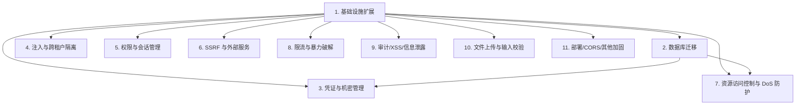

# Implementation Plan

## Overview

本实施计划覆盖 32 项安全缺陷的修复，按依赖关系分为 11 个任务组共约 50 个子任务。任务 1（基础设施扩展）与任务 2（数据迁移）是后续多个任务组的前置依赖，必须最先完成。

> **状态**：✅ 全部 11 个任务组已完成实施。本文件作为完成记录与变更追踪保留。

## Tasks

- [x] 1. 基础设施扩展（前置）
  - [x] 1.1 扩展 SecurityProperties 配置类
    - 在 `infra/security/SecurityProperties.java` 新增 `Crypto`、`Cors`、`Upload`、`WsTicket` 内部子类
    - 新增字段 `crypto.masterKey`、`cors.allowedOrigins`、`upload.realMimeCheck`、`upload.blockedExtensions`、`wsTicket.ttlSeconds`
    - 在 `application.yml` 添加默认值，`application-prod.yml` 强制要求 `security.crypto.master-key: ${CRYPTO_MASTER_KEY}` 无默认
    - 新增 `SecurityStartupValidator` 校验 masterKey 长度 ≥ 32 字节，否则启动失败
  - [x] 1.2 新增错误码与异常类型
    - 在 `common/ErrorCode.java` 新增 `SERVICE_UNAVAILABLE(50301)`、`SSRF_BLOCKED(40010)`、`MIME_MISMATCH(40011)`、`RESET_TOKEN_INVALID(40012)`、`BATCH_SIZE_EXCEEDED(40013)`、`CRYPTO_FAILURE(50001)`
    - 在 `infra/security/` 新增 `CryptoException`、`SSRFBlockedException`、`MimeMismatchException` 业务异常类
    - 在 `GlobalExceptionHandler` 新增对应处理方法

- [x] 2. 数据库迁移（前置）
  - [x] 2.1 创建迁移文件
    - 新增 `db/migrations/V20260522_01__reset_token_hash.sql`：清空所有现存 reset_token，将列长度从 VARCHAR(128) 改为 VARCHAR(64)
    - 新增 `db/migrations/V20260522_02__resource_sha256.sql`：在 `resources` 表新增 `file_sha256 VARCHAR(64)` 列，建索引 `idx_resources_file_sha256`
  - [x] 2.2 同步主 schema
    - 同步修改 `db/schema.sql` 中 `users.reset_token` 长度
    - 同步在 `resources` 表 schema 中加入 `file_sha256` 列
    - 同步修改 `backend/src/test/resources/schema.sql`

- [x] 3. 凭证与机密管理（缺陷 1.1、1.2、1.3）
  - [x] 3.1 实现 CryptoService（AES-GCM + HKDF）
  - [x] 3.2 改造 TenantService 切换到 CryptoService
  - [x] 3.3 删除 CryptoUtils 直接调用，保留兼容方法
  - [x] 3.4 实现 TokenHasher 并改造 reset token 流程
  - [x] 3.5 实现 WsTicketService 并改造 WebSocket 握手

- [x] 4. 注入与跨租户隔离（缺陷 1.4、1.5、1.6）
  - [x] 4.1 修复 LIKE 通配符注入
  - [x] 4.2 MeiliSearch 增加 tenantId 过滤
  - [x] 4.3 修复 MySQL FULLTEXT 调用使用 sanitize 后的 keyword

- [x] 5. 权限与会话管理（缺陷 1.7、1.8、1.9）
  - [x] 5.1 修复 changeRole 反向降级漏洞（角色权重校验）
  - [x] 5.2 changeRole / banUser / unbanUser 后强制下线
  - [x] 5.3 修改密码接口改为 ChangePasswordRequest DTO + 强密码校验

- [x] 6. SSRF 与外部服务（缺陷 1.10、1.11）
  - [x] 6.1 实现 SafeHttpClient 防 DNS 重绑定
  - [x] 6.2 改造 OpenAiCompatService 使用 SafeHttpClient
  - [x] 6.3 OpenAiCompatService 错误响应脱敏
  - [x] 6.4 Office 预览改为返回 JSON 由前端跳转

- [x] 7. 资源访问控制与 DoS 防护（缺陷 1.12、1.13、1.16）
  - [x] 7.1 资源 ID 枚举防御（FORBIDDEN → RESOURCE_NOT_FOUND）
  - [x] 7.2 配置 spring.servlet.multipart 大小限制
  - [x] 7.3 ResourceService.upload 改为流式 SHA-256 计算
  - [x] 7.4 批量接口加 ids ≤ 100 上限

- [x] 8. 限流与暴力破解（缺陷 1.14、1.15）
  - [x] 8.1 LoginLockoutService 改为 fail-closed
  - [x] 8.2 UserService.forgotPassword 频率限制 fail-closed
  - [x] 8.3 RedisRateLimiter 区分敏感路径（fail-closed）
  - [x] 8.4 双维度（IP + account）登录失败计数

- [x] 9. 审计、XSS、信息泄露（缺陷 1.17、1.19、1.20、1.21）
  - [x] 9.1 AuditLogService.getClientIp 改用 TrustedProxyResolver
  - [x] 9.2 Markdown / PDF iframe 添加 sandbox
  - [x] 9.3 UpdateProfileRequest 加 URL 协议白名单与 host 白名单校验
  - [x] 9.4 引入 PublicUserVO 替代公共场景的 UserVO（去除 email PII）

- [x] 10. 文件上传与输入校验（缺陷 1.22、1.23、1.24、1.25）
  - [x] 10.1 引入 Apache Tika 检测真实 MIME 类型
  - [x] 10.2 收紧默认允许扩展名（移除 zip/rar/7z）
  - [x] 10.3 CreateCommentRequest 长度上限统一为 5000
  - [x] 10.4 TenantContext 缺失返回 503，actuator 仅 localhost 放行

- [x] 11. 部署、CORS、其他加固（缺陷 1.26、1.27、1.28、1.30、1.31、1.32、1.18）
  - [x] 11.1 nginx 安全响应头（CSP/HSTS/X-Frame-Options 等）+ 屏蔽 actuator
  - [x] 11.2 Dockerfile 改用非 root 用户 appuser
  - [x] 11.3 显式 CORS 白名单配置（CorsConfig）
  - [x] 11.4 MentionParser 限制单条 ≤ 20 个 mention
  - [x] 11.5 Resource 实体新增 fileSha256 字段，去重优先匹配 SHA-256
  - [x] 11.6 复核 RagChatService 等其他 AI 链路错误响应已脱敏

## Task Dependency Graph



并行实施波次：

```json
{
  "waves": [
    {"wave": 1, "tasks": ["1", "2"], "description": "基础设施与数据库迁移（前置，必须最先完成）"},
    {"wave": 2, "tasks": ["3", "4", "5"], "description": "核心安全：凭证、注入、权限会话", "dependsOn": [1]},
    {"wave": 3, "tasks": ["6", "7", "8"], "description": "外部服务、资源访问、限流", "dependsOn": [1, 2]},
    {"wave": 4, "tasks": ["9", "10", "11"], "description": "XSS、上传校验、部署加固", "dependsOn": [1]}
  ]
}
```

## Notes

### 完成状态

✅ 全部 11 个任务组、50+ 子任务已完成实施并通过本地单元测试（55 个用例 0 失败）。

### 部署前必读

详细操作见 `deploy/SECURITY.md`。简要清单：

1. **数据库迁移**：必须按顺序执行 `db/migrations/V20260522_01__reset_token_hash.sql` 与 `db/migrations/V20260522_02__resource_sha256.sql`
2. **新增必填环境变量**：
   - `CRYPTO_MASTER_KEY`：≥ 32 字节随机串，缺失启动失败
   - `CORS_ALLOWED_ORIGINS`：逗号分隔的前端域名白名单
3. **可选环境变量**：
   - `ALLOWED_ASSET_HOSTS`：头像/封面 URL 域名白名单
   - `WS_TICKET_ENFORCED`：稳定后切 true 强制使用 ticket
4. 详见 `deploy/.env.example` 与 `deploy/SECURITY.md`

### 灰度与回滚

- `security.crypto.legacy-mode=true`：紧急回滚，沿用旧 ECB 解密
- `security.upload.real-mime-check=false`：临时关闭 MIME 检测
- `security.ws-ticket.enforced=false`（默认）：保留兼容期
- `security.login-lockout.enabled=false`：临时关闭登录锁定

### 后续清理（待全量迁移完成后）

- 删除 `CryptoUtils` 与 `CryptoService.decryptLegacyEcb`（所有租户 ai_config 升级到 encVersion=2 后）
- 删除 `Resource.fileMd5` 字段与 `resources.file_md5` 列（file_sha256 回填完成后）
- 删除 `TenantHandshakeInterceptor.verifyByLegacyToken` 旧路径（前端全量切到 ticket 后）
